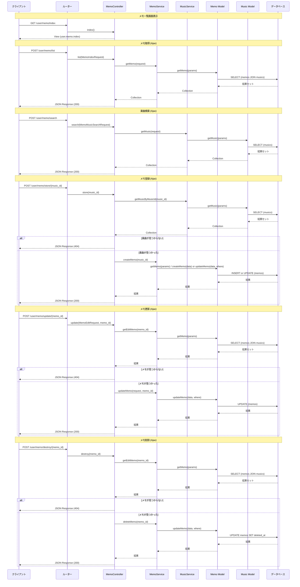

# MemoController 詳細設計書

## 1. 基本情報

- **クラス名**: `MemoController`
- **名前空間**: `App\Http\Controllers\User`
- **役割・目的**: ユーザー側のメモ機能に関するHTTPリクエストを処理するコントローラー。メモの一覧表示、取得、楽曲検索、登録、更新、削除（論理削除）の各操作を提供する。

### 関連サービス・コンポーネント

| コンポーネント | 種別 | 関係性 | 説明 |
|---|---|---|---|
| `App\Services\User\MemoService` | サービス | 依存 | メモのCRUD操作のビジネスロジックを提供 |
| `App\Services\User\MusicService` | サービス | 依存 | 楽曲検索・取得のビジネスロジックを提供 |
| `App\Http\Requests\User\MemoIndexRequest` | フォームリクエスト | 利用 | メモ一覧取得時のバリデーション |
| `App\Http\Requests\User\MemoEditRequest` | フォームリクエスト | 利用 | メモ更新時のバリデーション |
| `App\Http\Requests\User\MemoMusicSearchRequest` | フォームリクエスト | 利用 | 楽曲検索時のバリデーション |
| `App\Models\Memo` | モデル | 間接利用 | MemoService経由でメモデータの操作 |
| `App\Models\Music` | モデル | 間接利用 | MusicService経由で楽曲データの操作 |

## 2. クラス構造

### 継承関係

- **基底クラス**: `App\Http\Controllers\Controller`
- **実装インターフェース**: なし

`Controller` 基底クラスは以下のトレイトを使用:
- `AuthorizesRequests`
- `DispatchesJobs`
- `ValidatesRequests`

### クラス階層図

```
Illuminate\Routing\Controller (BaseController)
  └── App\Http\Controllers\Controller
        └── App\Http\Controllers\User\MemoController
```

## 3. 定数定義

### クラス固有定数

本クラスに固有の定数は定義されていない。

### 使用するその他の定数

| 定数名 | 値 | 説明 |
|---|---|---|
| `config('const.FLAG_OFF')` | `0` | チェックフラグOFF |
| `config('const.FLAG_ON')` | `1` | チェックフラグON |
| `config('const.DEFAULT_DATE_FORMAT')` | `'Y-m-d H:i:s'` | 日付フォーマット（論理削除時に使用） |
| `config('const.VERSION')` | 配列（0〜33） | IIDXバージョン一覧（楽曲検索バリデーションに使用） |

## 4. プロパティ

### プロパティ一覧

| 名前 | 型 | アクセス修飾子 | 初期値 | 説明 |
|---|---|---|---|---|
| `$memo` | `MemoService` | `private` | `new MemoService()` | メモ操作用サービスインスタンス |
| `$music` | `MusicService` | `private` | `new MusicService()` | 楽曲操作用サービスインスタンス |

### プロパティ詳細

#### `$memo`
- **型**: `App\Services\User\MemoService`
- **説明**: メモの取得・登録・更新・削除に関するビジネスロジックを提供するサービスクラスのインスタンス
- **使用箇所**: `list()`, `store()`, `update()`, `destroy()`

#### `$music`
- **型**: `App\Services\User\MusicService`
- **説明**: 楽曲の検索・取得に関するビジネスロジックを提供するサービスクラスのインスタンス
- **使用箇所**: `search()`, `store()`

## 5. 処理フロー

### シーケンス図



## 6. メソッド仕様

### `__construct()`

- **シグネチャ**: `public function __construct()`
- **説明**: コンストラクタ。`MemoService` および `MusicService` のインスタンスを生成し、プロパティに保持する。
- **パラメータ**: なし
- **戻り値**: なし
- **例外**: なし
- **処理フロー**:
  1. `MemoService` のインスタンスを生成し `$this->memo` に代入
  2. `MusicService` のインスタンスを生成し `$this->music` に代入

---

### `index()`

- **シグネチャ**: `public function index()`
- **説明**: メモ一覧画面のビューを返却する。

#### パラメータ

なし

#### 戻り値

| 型 | 説明 | 備考 |
|---|---|---|
| `\Illuminate\View\View` | メモ一覧画面のビュー | ビュー名: `user.memo.index` |

#### 例外

なし

#### 処理フロー

1. `user.memo.index` ビューを返却する

---

### `list(MemoIndexRequest $request)`

- **シグネチャ**: `public function list(MemoIndexRequest $request)`
- **説明**: ログインユーザーが持つメモをJSON形式で返却する。Ajaxリクエストから呼び出される。

#### パラメータ

| 名前 | 型 | 必須 | 説明 | デフォルト値 |
|---|---|---|---|---|
| `$request` | `MemoIndexRequest` | はい | メモ一覧取得リクエスト | - |

`MemoIndexRequest` のバリデーションルール:

| フィールド | ルール |
|---|---|
| `memo_id` | `nullable\|numeric` |

#### 戻り値

| 型 | 説明 | 備考 |
|---|---|---|
| `\Illuminate\Http\JsonResponse` | メモデータのJSON | HTTPステータス: 200 |

#### 例外

なし（バリデーションエラーはフォームリクエストが処理）

#### 処理フロー

1. `MemoService::getMemo($request)` を呼び出し、メモデータを取得
2. 取得結果をJSON形式（HTTPステータス200）で返却

---

### `search(MemoMusicSearchRequest $request)`

- **シグネチャ**: `public function search(MemoMusicSearchRequest $request)`
- **説明**: 楽曲検索結果をJSON形式で返却する。Ajaxリクエストから呼び出される。

#### パラメータ

| 名前 | 型 | 必須 | 説明 | デフォルト値 |
|---|---|---|---|---|
| `$request` | `MemoMusicSearchRequest` | はい | 楽曲検索リクエスト | - |

`MemoMusicSearchRequest` のバリデーションルール:

| フィールド | ルール |
|---|---|
| `version` | `nullable\|in:` + VERSIONキー値（0〜33） |
| `free` | `nullable\|max:255` |

#### 戻り値

| 型 | 説明 | 備考 |
|---|---|---|
| `\Illuminate\Http\JsonResponse` | 楽曲データのJSON | HTTPステータス: 200 |

#### 例外

なし（バリデーションエラーはフォームリクエストが処理）

#### 処理フロー

1. `MusicService::getMusic($request)` を呼び出し、楽曲データを取得
2. 取得結果をJSON形式（HTTPステータス200）で返却

---

### `store($music_id)`

- **シグネチャ**: `public function store($music_id)`
- **説明**: 指定された楽曲IDに対するメモを登録する。楽曲が存在しない場合は404エラーを返却する。

#### パラメータ

| 名前 | 型 | 必須 | 説明 | デフォルト値 |
|---|---|---|---|---|
| `$music_id` | `mixed` | はい | 楽曲ID（URLパラメータ） | - |

#### 戻り値

| 型 | 説明 | 備考 |
|---|---|---|
| `\Illuminate\Http\JsonResponse` | 処理結果のJSON | 成功時: 200、楽曲未存在時: 404 |

#### 例外

| 例外クラス | 発生条件 | 説明 |
|---|---|---|
| なし | - | エラー時はJSONレスポンスで返却 |

#### 処理フロー

1. `MusicService::getMusicByMusicId($music_id)` を呼び出し、楽曲の存在確認
2. 楽曲が存在しない場合（`empty($music)`）:
   - エラーメッセージ「楽曲が見つかりませんでした。」をJSON形式（HTTPステータス404）で返却
3. 楽曲が存在する場合:
   - `MemoService::createMemo($music_id)` を呼び出し、メモを登録
   - 成功メッセージ「メモを登録しました。」をJSON形式（HTTPステータス200）で返却

---

### `update(MemoEditRequest $request, $memo_id)`

- **シグネチャ**: `public function update(MemoEditRequest $request, $memo_id)`
- **説明**: 指定されたメモIDのメモを更新する。メモが存在しない場合は404エラーを返却する。

#### パラメータ

| 名前 | 型 | 必須 | 説明 | デフォルト値 |
|---|---|---|---|---|
| `$request` | `MemoEditRequest` | はい | メモ更新リクエスト | - |
| `$memo_id` | `mixed` | はい | メモID（URLパラメータ） | - |

`MemoEditRequest` のバリデーションルール:

| フィールド | ルール |
|---|---|
| `memo` | `nullable` |

#### 戻り値

| 型 | 説明 | 備考 |
|---|---|---|
| `\Illuminate\Http\JsonResponse` | 処理結果のJSON | 成功時: 200、メモ未存在時: 404 |

#### 例外

| 例外クラス | 発生条件 | 説明 |
|---|---|---|
| なし | - | エラー時はJSONレスポンスで返却 |

#### 処理フロー

1. `MemoService::getEditMemo($memo_id)` を呼び出し、対象メモの存在確認
2. メモが存在しない場合（`empty($memo)`）:
   - エラーメッセージ「メモが見つかりませんでした。」をJSON形式（HTTPステータス404）で返却
3. メモが存在する場合:
   - `MemoService::updateMemo($request, $memo_id)` を呼び出し、メモを更新
   - 成功メッセージ「メモを更新しました。」をJSON形式（HTTPステータス200）で返却

---

### `destroy($memo_id)`

- **シグネチャ**: `public function destroy($memo_id)`
- **説明**: 指定されたメモIDのメモを論理削除する。メモが存在しない場合は404エラーを返却する。

#### パラメータ

| 名前 | 型 | 必須 | 説明 | デフォルト値 |
|---|---|---|---|---|
| `$memo_id` | `mixed` | はい | メモID（URLパラメータ） | - |

#### 戻り値

| 型 | 説明 | 備考 |
|---|---|---|
| `\Illuminate\Http\JsonResponse` | 処理結果のJSON | 成功時: 200、メモ未存在時: 404 |

#### 例外

| 例外クラス | 発生条件 | 説明 |
|---|---|---|
| なし | - | エラー時はJSONレスポンスで返却 |

#### 処理フロー

1. `MemoService::getEditMemo($memo_id)` を呼び出し、対象メモの存在確認
2. メモが存在しない場合（`empty($memo)`）:
   - エラーメッセージ「メモが見つかりませんでした。」をJSON形式（HTTPステータス404）で返却
3. メモが存在する場合:
   - `MemoService::deleteMemo($memo_id)` を呼び出し、メモを論理削除
   - 成功メッセージ「メモを一覧から削除しました。」をJSON形式（HTTPステータス200）で返却

## 7. データベース操作仕様

### 使用DSN

- `config('database.connections.mysql')` で定義されるMySQL接続を使用
- ホスト: `env('DB_HOST', '127.0.0.1')`
- ポート: `env('DB_PORT', '3306')`
- データベース: `env('DB_DATABASE', 'forge')`

### 使用テーブル

| テーブル名 | 操作種別 | 用途 | メソッド名 | DB名 |
|---|---|---|---|---|
| `memos` | SELECT | メモ取得 | `list()`, `update()`, `destroy()` | `env('DB_DATABASE')` |
| `memos` | INSERT | メモ新規登録 | `store()` | `env('DB_DATABASE')` |
| `memos` | UPDATE | メモ更新・論理削除・復活 | `store()`, `update()`, `destroy()` | `env('DB_DATABASE')` |
| `musics` | SELECT | 楽曲検索・楽曲存在確認 | `search()`, `store()`, `list()` | `env('DB_DATABASE')` |

### SQL詳細

#### メモ取得（`list()` → `MemoService::getMemo()` → `Memo::getMemo()`）

- **用途**: ログインユーザーに紐づくメモを取得
- **SQL文**:
```sql
SELECT
    memos.id AS memo_id,
    memos.user_id,
    memos.music_id,
    memos.memo,
    memos.check_flag,
    musics.version,
    musics.title,
    musics.genre,
    musics.artist,
    musics.bpm,
    musics.popular_name,
    musics.sp_beginner,
    musics.sp_normal,
    musics.sp_hyper,
    musics.sp_another,
    musics.sp_leggendaria,
    musics.dp_beginner,
    musics.dp_normal,
    musics.dp_hyper,
    musics.dp_another,
    musics.dp_leggendaria
FROM musics
LEFT JOIN memos ON memos.music_id = musics.id
WHERE memos.user_id = :user_id
    AND memos.deleted_at IS NULL
    AND musics.deleted_at IS NULL
ORDER BY musics.title ASC
```
- **パラメータ**: `user_id` (認証ユーザーID)、その他検索条件（`memo_id`, `version`, `sp_difficulty`, `dp_difficulty`, `search_free`, `memo_radio`, `check_flag_radio`）
- **戻り値**: `Collection`（メモと楽曲情報の結合データ）
- **トランザクション**: なし（参照のみ）

#### 楽曲検索（`search()` → `MusicService::getMusic()` → `Music::getMusic()`）

- **用途**: 楽曲をバージョン・フリーワード等で検索
- **SQL文**:
```sql
SELECT * FROM musics
WHERE deleted_at IS NULL
    [AND version = :version]
    [AND (title LIKE :free OR genre LIKE :free OR artist LIKE :free OR popular_name LIKE :free)]
ORDER BY title ASC
```
- **パラメータ**: `version`（任意）、`free`（任意・部分一致検索）
- **戻り値**: `Collection`（楽曲データ）
- **トランザクション**: なし（参照のみ）

#### メモ登録（`store()` → `MemoService::createMemo()` → `Memo::createMemo()` or `Memo::updateMemo()`）

- **用途**: メモの新規登録または論理削除済みメモの復活
- **SQL文（新規登録）**:
```sql
INSERT INTO memos (user_id, music_id) VALUES (:user_id, :music_id)
```
- **SQL文（復活）**:
```sql
UPDATE memos SET deleted_at = NULL
WHERE id = :id AND user_id = :user_id AND music_id = :music_id
```
- **パラメータ**: `user_id`（認証ユーザーID）、`music_id`（楽曲ID）
- **戻り値**: `bool`（成功/失敗）
- **トランザクション**: あり（`DB::beginTransaction()` / `DB::commit()` / `DB::rollback()`）

#### メモ更新（`update()` → `MemoService::updateMemo()` → `Memo::updateMemo()`）

- **用途**: メモ内容とチェックフラグの更新
- **SQL文**:
```sql
UPDATE memos SET check_flag = :check_flag, memo = :memo
WHERE id = :memo_id AND user_id = :user_id
```
- **パラメータ**: `check_flag`、`memo`、`memo_id`、`user_id`（認証ユーザーID）
- **戻り値**: `int`（更新件数）
- **トランザクション**: あり

#### メモ削除（`destroy()` → `MemoService::deleteMemo()` → `Memo::updateMemo()`）

- **用途**: メモの論理削除（`deleted_at` に現在日時をセット）
- **SQL文**:
```sql
UPDATE memos SET deleted_at = :deleted_at
WHERE id = :memo_id AND user_id = :user_id
```
- **パラメータ**: `deleted_at`（`date('Y-m-d H:i:s')`形式）、`memo_id`、`user_id`（認証ユーザーID）
- **戻り値**: `int`（更新件数）
- **トランザクション**: あり

## 8. ログ出力仕様

### ログレベル

- **ERROR**: データベース操作時の例外発生時（Model層で出力）

### ログ出力箇所

MemoController自体にはログ出力処理はない。ログ出力はModel層（`Memo`モデル）で行われる。

| 出力箇所 | ログレベル | メッセージ |
|---|---|---|
| `Memo::createMemo()` 例外発生時 | ERROR | `メモ登録中に例外が発生しました:{例外メッセージ}` |
| `Memo::updateMemo()` 例外発生時 | ERROR | `メモ更新中に例外が発生しました:{例外メッセージ}` |

### ログファイル設定

- Laravelデフォルトのログ設定に従う（`config/logging.php`）
- デフォルトチャネル: `env('LOG_CHANNEL', 'stack')`

### ログファイル例

```
[2026-05-02 03:00:00] local.ERROR: メモ登録中に例外が発生しました:SQLSTATE[23000]: Integrity constraint violation: 1062 Duplicate entry ...
[2026-05-02 03:00:00] local.ERROR: メモ更新中に例外が発生しました:SQLSTATE[42S02]: Base table or view not found ...
```

## 9. エラーハンドリング

### 例外処理

| 例外クラス | 発生条件 | 処理内容 | ログ出力 |
|---|---|---|---|
| `Exception` | `Memo::createMemo()` でDB操作失敗時 | ロールバック後 `abort(500)` | ERROR レベルで例外メッセージ出力 |
| `Exception` | `Memo::updateMemo()` でDB操作失敗時 | ロールバック後 `abort(500)` | ERROR レベルで例外メッセージ出力 |
| `ValidationException` | フォームリクエストのバリデーション失敗時 | Laravel標準の422レスポンス | なし |

### エラーレスポンス

| HTTPステータス | 条件 | レスポンスボディ |
|---|---|---|
| 404 | `store()`: 指定楽曲が存在しない | `{"errors": ["楽曲が見つかりませんでした。"]}` |
| 404 | `update()`: 指定メモが存在しない | `{"errors": ["メモが見つかりませんでした。"]}` |
| 404 | `destroy()`: 指定メモが存在しない | `{"errors": ["メモが見つかりませんでした。"]}` |
| 422 | バリデーションエラー | Laravel標準のバリデーションエラーレスポンス |
| 500 | DB操作時の例外 | Laravel標準のサーバーエラーレスポンス（`abort(500)`） |

### リトライ処理

| 処理名 | リトライ回数 | 間隔 | 条件 | 最大リトライ後の処理 |
|---|---|---|---|---|
| - | - | - | - | - |

本クラスおよび関連サービスにリトライ処理は実装されていない。

## 10. 変更履歴

| バージョン | 日付 | 変更内容 |
|---|---|---|
| 1.0 | 2026-05-02 | 初版作成 |
